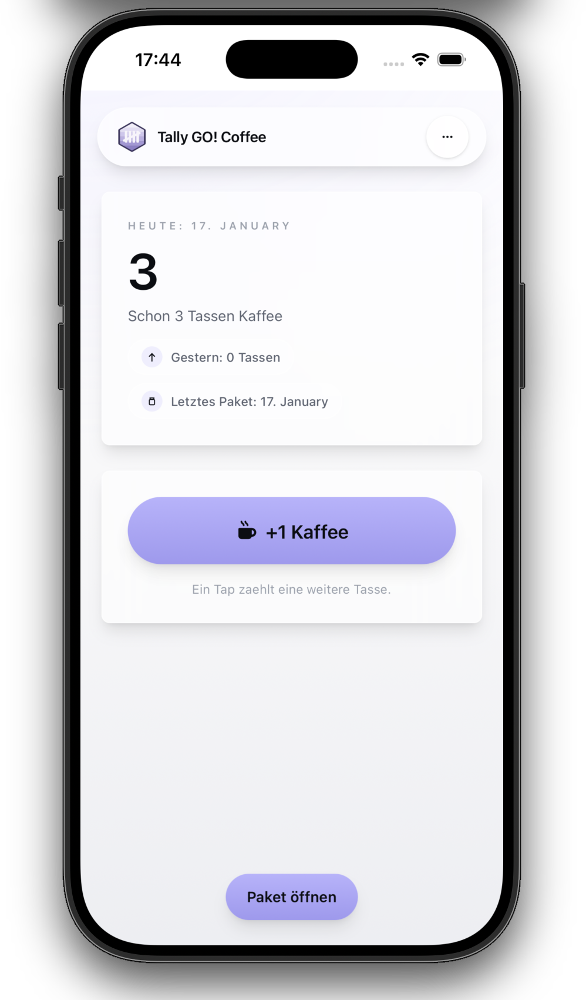
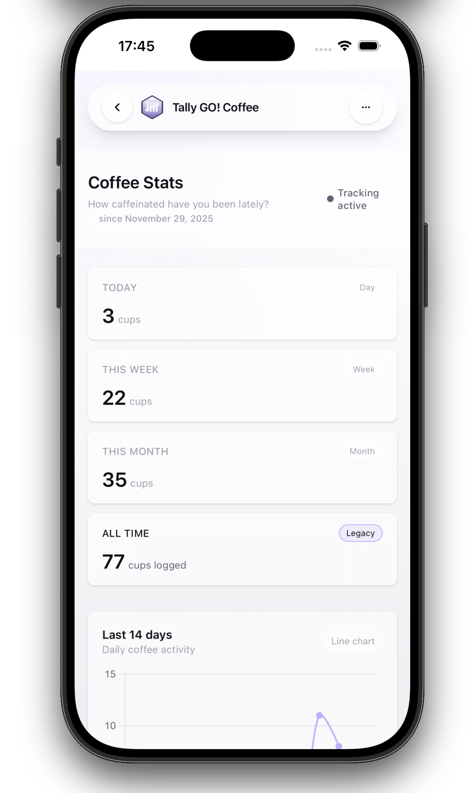
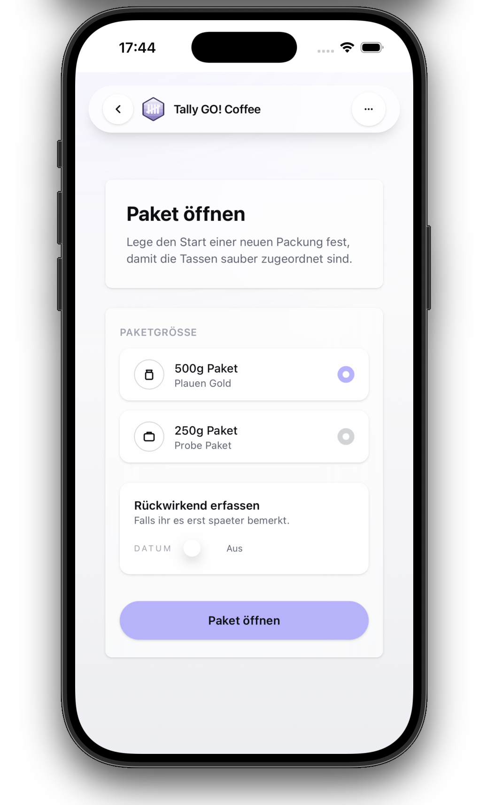
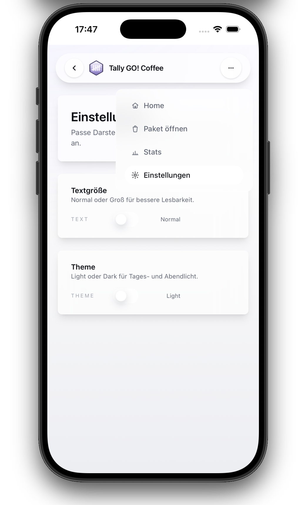

# Tally GO! Coffee

A small Rails 8 app for tracking coffee consumption and packages.
Built with ERB, TailwindCSS, Hotwire, and the Rails asset pipeline.

## Goals

Tally GO! stays lightweight: fast logging, clear stats, and a simple UI.
If it ever stops being simple, it is wrong.

## Features

- Quick add for coffee cups
- Package tracking (250g / 500g)
- Stats dashboard
- Settings: Light/Dark theme + Normal/Large text size (stored per device)
- Liquid Glass-inspired UI

## Setup

```bash
git clone git@github.com:idev4u/CoffeeCupLogbook.git
cd CoffeeCupLogbook
bundle install
bin/rails db:setup
bin/dev
```

The app runs on:

```
http://localhost:3000
```

## Structure

Tailwind entrypoint:

```
app/assets/tailwind/application.css
```

App styles:

```
app/assets/stylesheets/application.css
```

Layout:

```
app/views/layouts/application.html.erb
```

Navbar:

```
app/views/layouts/_navbar.html.erb
```

Assets:

```
app/assets/images/
```

## Screenshots

<table>
  <tr>
    <td><strong>Home</strong></td>
    <td><strong>Stats</strong></td>
  </tr>
  <tr>
    <td></td>
    <td></td>
  </tr>
  <tr>
    <td><strong>Paket öffnen</strong></td>
    <td><strong>Settings / Menu</strong></td>
  </tr>
  <tr>
    <td></td>
    <td></td>
  </tr>
</table>

## Deployment

Uses Kamal for deployment.
SQLite database stored on a mounted volume outside the container.

Backup accessory example:

```yaml
accessories:
  backup:
    image: <your docker hub user>/cupcounter
    host: homeserver.local
    directories:
      - "/Users/<your account>/storage/local_s3/cupcounter:/rails/storage"
    env:
      clear:
        DB_PATH: /rails/storage/production.sqlite3
        BACKUP_DIR: /rails/storage/backups
        BACKUP_KEEP: 5
    cmd: "bash -lc 'while true; do /rails/bin/backup_sqlite; sleep 86400; done'"
```

## Deployment (Kamal)

### Proxy Reset (Host-conflicts)

If the proxy returns 502 or there is a host conflict, an old proxy state is often stored.

Reset on the host:

```sh
ssh apprunner@homeserver.local 'docker exec kamal-proxy rm -f /home/kamal-proxy/.config/kamal-proxy/kamal-proxy.state'
ssh apprunner@homeserver.local 'docker restart kamal-proxy'
```

Then redeploy the affected service (in the respective repository):

```sh
bin/kamal deploy
```

---

## Support

If you want to support the work on Tally Go!, you can do so here:

<a href="https://buymeacoffee.com/idev4u" target="_blank">
  
</a>

---

[more details](docs/extend_details.md)
